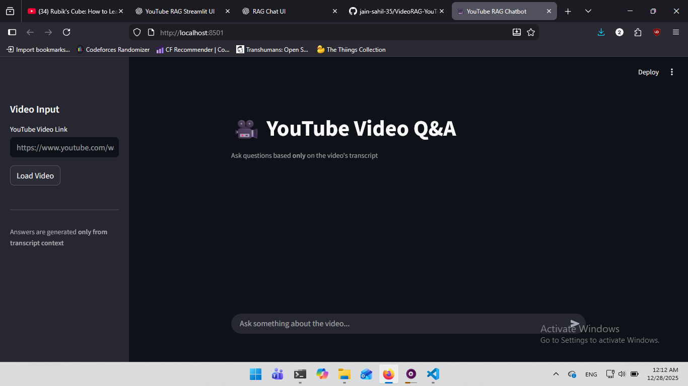

# 🎥 YouTube Video Q&A Chatbot (RAG)

A **Retrieval-Augmented Generation (RAG)** based chatbot that answers questions **strictly from a YouTube video's transcript**.

Built with **Streamlit**, **LangChain**, **FAISS**, and **HuggingFace models**.

---

## 🚀 Features

- 🔍 Extracts and processes YouTube video transcripts
- 🧠 Semantic search using FAISS vector store
- 💬 Chat-style UI with conversation history
- 🔒 Answers strictly grounded in transcript context
- 🎨 Clean, dark-themed Streamlit interface
- ♻️ Cached embeddings per video for efficiency

---

## 🧱 Tech Stack

- **Frontend**: Streamlit
- **LLM**: HuggingFace Endpoint
- **Embeddings**: Sentence Transformers
- **Vector DB**: FAISS
- **Framework**: LangChain
- **Data Source**: YouTube Transcript API

---

## 📸 Demo



---

## 🛠️ Setup Instructions

### 1️⃣ Clone the repository
```bash
git clone https://github.com/your-username/youtube-rag-chatbot.git
cd youtube-rag-chatbot
```

### 2️⃣ Create Virtual Environment
```bash
python -m venv venv
source venv/bin/activate   # Windows: venv\Scripts\activate
```

### 3️⃣ Install dependencies
```bash
pip install -r requirements.txt
```

### 4️⃣ Set environment variables (Create a .env file)
```env
HUGGINGFACEHUB_API_TOKEN=your_api_key_here
```

### 5️⃣ Run the app
```bash
streamlit run app.py
```

---

## 🧠 How It Works (RAG Flow)

1. Fetches transcript from YouTube video  
2. Splits transcript into overlapping text chunks  
3. Converts chunks into vector embeddings  
4. Stores embeddings in FAISS  
5. Retrieves relevant chunks for each question  
6. Generates an answer grounded only in retrieved context  

---

## 📄 License

MIT License